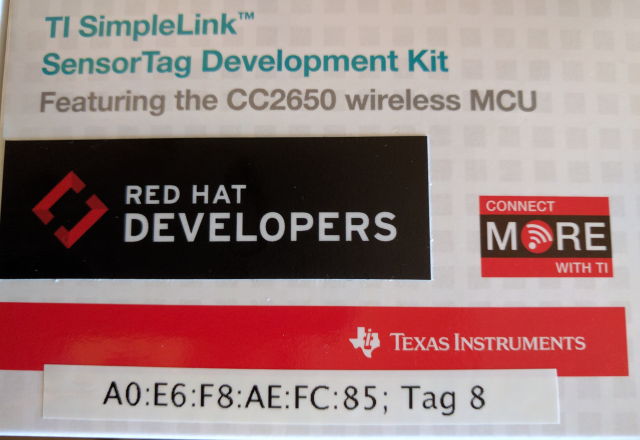

# RHIoTTagGameProject

This game application illustrates interacting with the RHIoTTag sensor package. You need to complete a few setup tasks to connect the client to the cloud broker, and extract the 

## CodeSourceTODOs.java
The series of TODOs that you need to perform to complete the integration with the cloud broker is located in the src/main/java/org/jboss/rhiot/game/CodeSourceTODOs.java file. The javadoc for the class describes the steps, but they are repeated here with additions where approriate.

### Step 1, set CodeSourceTODOs.MY_TAG_NO
You need to assign the MY_TAG_NO variable to the tag number assigned to you. There are 8 tags at each table, and each box has the BLE address of the RHIoTTag as well as the tag number. In the image shown here, the tag number is 4. Set MY_TAG_NO to the value for your tag.

### Step 2, set CodeSourceTODOs.MY_GW_NO

You need to assign the MY_GW_NO value to the gateway number at your table. This ensures you are filtering your cloud broker subscription to messages published by your table gateway. You will receive no messages if this is not set correctly.

### Step 3, set CodeSourceTODOs.MY_TAG_ADDRESS

You need to assign your MY_TAG_ADDRESS to the BLE address printed on you RHIoTTag box. This is required in order for the gateway at your table to accept the advertising events from your RHIoTTag for both publishing to the cloud broker as well as running the game state machine. In the previous example image, the address is A0:E6:F8:B7:0B:00

### Step 4, complete CodeSourceTODOs.getSubscriptionTopic()
 
Complete the getSubscriptionTopic to select the data topic for you RHIoTTag. From the overview slides, recall that each gateway publishes its messages for the RHIoTTags 

 * 5. Complete the first set of methods that extract the metrics for the tag data. This information provides feedback on the
 * button press states of the tag as well as the light sensor reading.
 * @see #extractTemperature(EdcPayload)
 * @see #extractKeyState(EdcPayload)
 * @see #extractLuxReading(EdcPayload)
 *
 * 6. Complete the second set of methods that extract the metrics for the tag game state information. This information provides
 * feeback about the game state machine and is only sent when there is a state change.
 * @see #extractEvent(EdcPayload)
 * @see #extractPrevState(EdcPayload)
 * @see #extractState(EdcPayload)
 *
 * 7. Complete the third set of methods that extract the game run information. This information tells you how many shots
 * are left, how much time is left in the shooting window and the game, as well as the score.
 * @see #extractGameScore(EdcPayload)
 * @see #extractGameTimeLeft(EdcPayload)
 * @see #extractShootingWindowTimeLeft(EdcPayload)
 * @see #extractShotsLeft(EdcPayload)
 *
 * 8. Complete the fourth set of methods that extract the hit score and distance from center. This information tells you
 * what score was assigned to a hit and how many rings from center it was.

