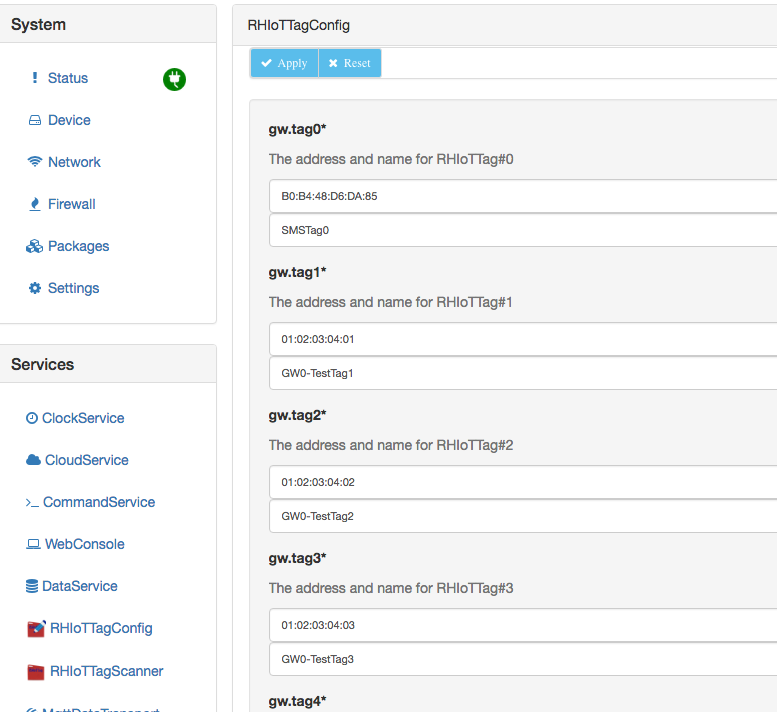
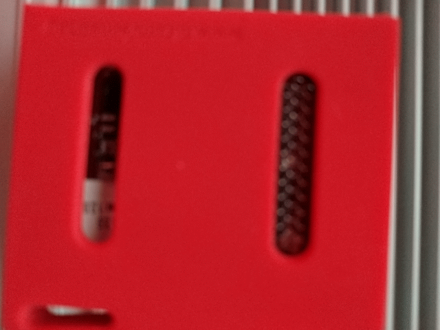
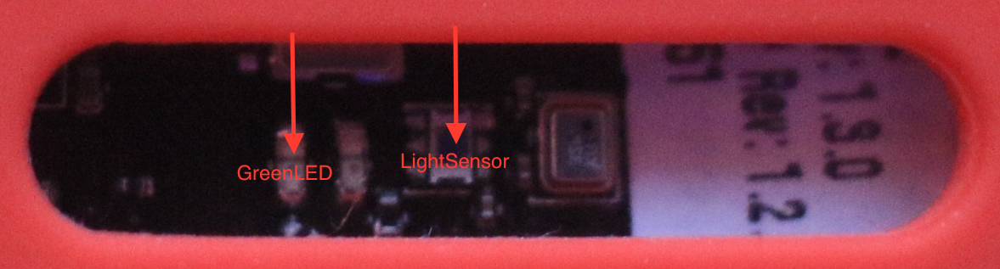

# RHIoTTagGameProject

This game application illustrates interacting with the RHIoTTag sensor package. You need to complete a few setup tasks to connect the client to the cloud broker, and extract the metric information from the broker messages the application receives.

## Step 0, Associate Your RHIoTTag with the Gateway
Your RHIoTTag box has the BLE address and tag number for the table as shown in the following image:


In order for the gateway to accept the data events broadcast by your tag, you need to create a mapping from your tag's BLE address to a name you want to associate with it. To do this, open your gateway's admin console by going to the [http://mygatewayip:8080/kura](http://mygatewayip:8080/kura) where mygatewayip is printed on the card by the gateway. The login is admin/admin.

Once you have the admin interface up, select the RHIoTTagConfig under the Services section to pull up a view that looks like the following:



NOTE: THIS STEP IS GOING TO REQUIRE COORDINATION AT YOUR TABLE!!! EACH PERSON NEEDS TO UPDATE THEIR TAG AND THEN SIGNAL THEIR COMPLETION SO THAT THE NEXT PERSON CAN TAKE THE UPDATE TOKEN. WHAT YOU DON'T WANT IS TO HAVE EACH OTHER OVERWRITING THE TAG ADDRESS TO NAME MAPPING.

In there, choose the field that corresponds to your tag number. For example, for the tag label above, you would use the gw.tag8 fields to enter the A0:E6:F8:AE:FC:85 address in the first field, and then whatever name you want associated with the tag in the second field.  
After it is entered, click the Apply button to save the configuration. You will be prompted if you want to apply the change, say yes.

You can use wget or curl to query the RHIoTTagService to verify that it has applied the address to name mapping using a get on http://mygatewayip:8080/rhiot/tags. For example:

`wget -qO - http://192.168.1.181:8080/rhiot/tags
[{"address":"01:02:03:04:02","name":"GW0-TestTag2"},{"address":"01:02:03:04:03","name":"GW0-TestTag3"},{"address":"01:02:03:04:04","name":"GW0-TestTag4"},{"address":"01:02:03:04:05","name":"MyTag#5"},{"address":"01:02:03:04:06","name":"MyTag#6"},{"address":"01:02:03:04:07","name":"MyTag#7"},{"address":"B0:B4:48:D6:DA:85","name":"SMSTag0"},{"address":"01:02:03:04:01","name":"GW0-TestTag1"}]`

OR

`[RHIoTTagServices 616]$ curl http://192.168.1.181:8080/rhiot/tags
[{"address":"01:02:03:04:02","name":"GW0-TestTag2"},{"address":"01:02:03:04:03","name":"GW0-TestTag3"},{"address":"01:02:03:04:04","name":"GW0-TestTag4"},{"address":"01:02:03:04:05","name":"MyTag#5"},{"address":"01:02:03:04:06","name":"MyTag#6"},{"address":"01:02:03:04:07","name":"MyTag#7"},{"address":"B0:B4:48:D6:DA:85","name":"SMSTag0"},{"address":"01:02:03:04:01","name":"GW0-TestTag1"}]`


## CodeSourceTODOs.java
The series of TODOs that you need to perform to complete the integration with the cloud broker is located in the src/main/java/org/jboss/rhiot/game/CodeSourceTODOs.java file. The javadoc for the class describes the steps, but they are repeated here with additions where approriate.

### Step 1, set CodeSourceTODOs.MY_TAG_NO
You need to assign the MY_TAG_NO variable to the tag number assigned to you. There are 8-9 tags at each table, and each box has the BLE address of the RHIoTTag as well as the tag number. In the image shown above, the tag number is 8. Set MY_TAG_NO to the value for your tag.


### Step 2, set CodeSourceTODOs.MY_GW_NO

You need to assign the MY_GW_NO value to the gateway number at your table. This ensures you are filtering your cloud broker subscription to messages published by your table gateway. You will receive no messages if this is not set correctly.

### Step 3, set CodeSourceTODOs.MY_TAG_ADDRESS

You need to assign your MY_TAG_ADDRESS to the BLE address printed on you RHIoTTag box. This is required in order for the gateway at your table to accept the advertising events from your RHIoTTag for both publishing to the cloud broker as well as running the game state machine. In the previous example image, the address is A0:E6:F8:B7:0B:00

### Step 4, set CodeSourceTODOs.PASSWORD
You need to change the CodeSourceTODOs.PASSWORD to the password given on the table card as the Cloud password value. This is required for accessing the cloud message broker.

### Step 5, complete CodeSourceTODOs.getSubscriptionTopic()

Complete the getSubscriptionTopic to select the data topic for you RHIoTTag. From the overview slides, recall that each gateway publishes its messages for the RHIoTTags to a topic with a pattern:

`Red-Hat/{gatewayID}/org.jboss.rhiot.services.RHIoTTagScanner/data/{address}` 

where `{gatewayID}` is the name assigned to your gateway. It is printed on the card next to the gateway and is of the form DN2016-GW{N} where N is [0..13].

The `{address}` value is the BLE address of the tag sending the data, so this needs to match your tag's address.

The `getSubscriptionTopic(String topicRoot)` method is given the `Red-Hat/{gatewayID}/org.jboss.rhiot.services.RHIoTTagScanner` portion of the topic name as the `topicRoot` parameter.

### Step 6, Complete the first set of methods that extract the metrics for the tag data. 

This information provides feedback on the button press states of the tag as well as the light sensor reading. Refer to the presentation slides on the Metrics that are sent for the names to use. These names are also found in the org.jboss.rhiot.services.api.IRHIoTTagScanner interface as constants, and these are referened in the javadoc of the extract* methods.

 * @see #extractTemperature(EdcPayload)
 * @see #extractKeyState(EdcPayload)
 * @see #extractLuxReading(EdcPayload)

### Step 7, Complete the second set of methods that extract the metrics for the tag game state information.

This information provides feeback about the game state machine and is only sent when there is a state change.

 * @see #extractEvent(EdcPayload)
 * @see #extractPrevState(EdcPayload)
 * @see #extractState(EdcPayload)


### Step 8, Complete the third set of methods that extract the game run information.

This information tells you how many shots are left, how much time is left in the shooting window and the game, as well as the score.

 * @see #extractGameScore(EdcPayload)
 * @see #extractGameTimeLeft(EdcPayload)
 * @see #extractShootingWindowTimeLeft(EdcPayload)
 * @see #extractShotsLeft(EdcPayload)

### Step 9. Complete the fourth set of methods that extract the hit score and distance from center.

This information tells you what score was assigned to a hit and how many rings from center it was.

 * @see #extractHitDistance(EdcPayload)
 * @see #extractHitScore(EdcPayload)
 

# Play the Game
At this point you should have the tag associated with the gateway and the game UI configured to receive the MQTT messages from the cloud broker, and have it extracting the message metrics for display in the UI.  Launch the game UI by running the org.jboss.rhiot.game.Main entry point.

Now make sure your RHIoTTag is broadcasting. You should see the green LED flashing on the back of the tag as shown in this picture:



If you don't, make sure you have pulled the plastic tab out to expose the battery contacts. At this point if everything it hooked up correctly, you will see the real time LUX value from the light sensor showing up in the bottom right of the UI in the LuxReading field.

Move the sensor around and cover the light sensor, expose the light sensor to you laptop screen, and hit it with the laser pointer to see how these affect the sensor reading.

The following image shows exactly where the light sensor is located in relation to the green LED:


If your not seeing the LuxReading vary, double check that you have the steps completed, and check the log output of the application. If needed, you can crank up the log output by editing the log4.properties file found in the src/main/resources directory of the project. Change the log4j.logger.com.eurotech=WARN setting to DEBUG to see more information.

```
## eurotech
log4j.logger.com.eurotech=DEBUG
```

You should also be able to press the left and right buttons on the RHIoTTag and have the ButtonState context box display matching state value. You may need to hold the button a bit as the tag only reads the sensor states every 0.5 seconds.


## Start the Game
Once you are seeing that the UI is receiving the light sensor data and key presses, you are ready to play the game. To start the game, hold the left and right buttons at the same time until you see a LEFT_RIGHT_PRESSED event and the game begins.

Now use your laser pointer to shoot the light sensor on the back of the tag. Hits will be displayed in the game UI and your score will be updated. You have 45 seconds and 6 shots in each shooting window. If you achieve more than 6 hits in a shooting window, you will need to reload by hitting the right button. The UI will prompt you to do this when it receives the CLIP_EMPTY state notification.

When the shooting window expires, you will need to press the left button to replace the target. The UI will prompt you to do this when it receives the REPLACE_TARGET state.

Continue through the game states until the game expires, and then check your score against everyone else by checking out the game scoreboard application we will be running on the main projector.

Play as many games as you like. The running score board and top scores will be displayed on the scoreboard application shown on the main projector.

You can also check out the HTML/JavaScript browser based version of the game UI. You will need to go through similar steps to configure it to receive and extract the message broker information.
